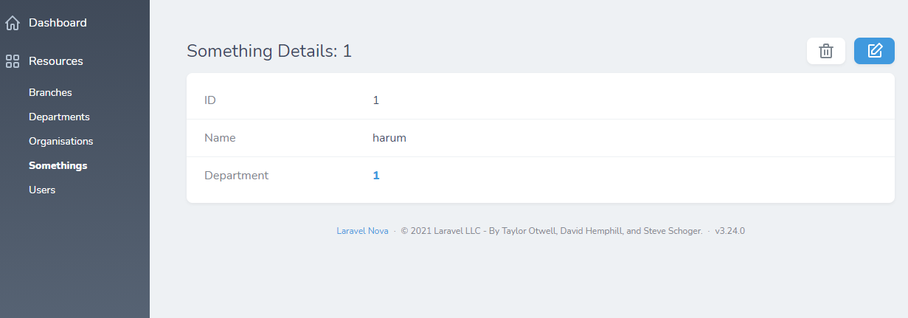
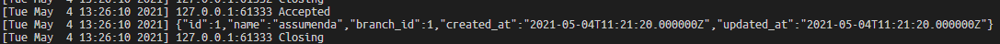

# Laravel nova Issue 3373

Issue 3373: https://github.com/laravel/nova-issues/issues/3373

## Recreating the issue

1. Edit Something 1 

2. Take a look at the console. The printed department object should have the right values: 

3. Save Something 1 without editing anything 

4. Take a look at the console. The printed department object has the joined values of its branch: 
